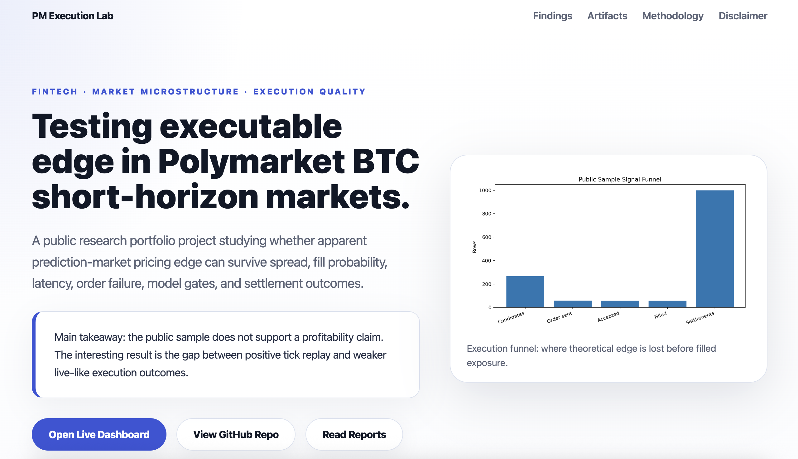
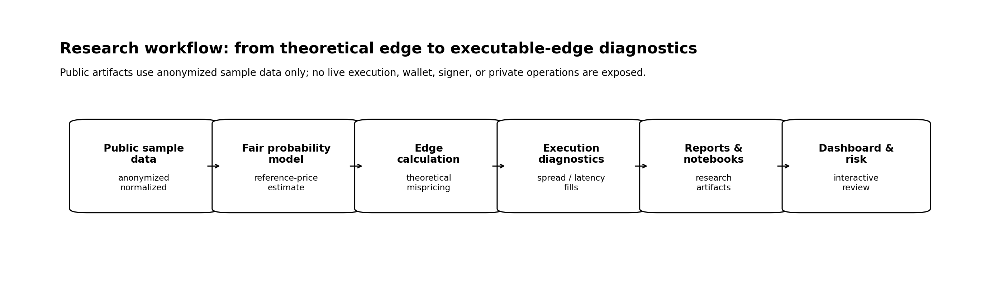
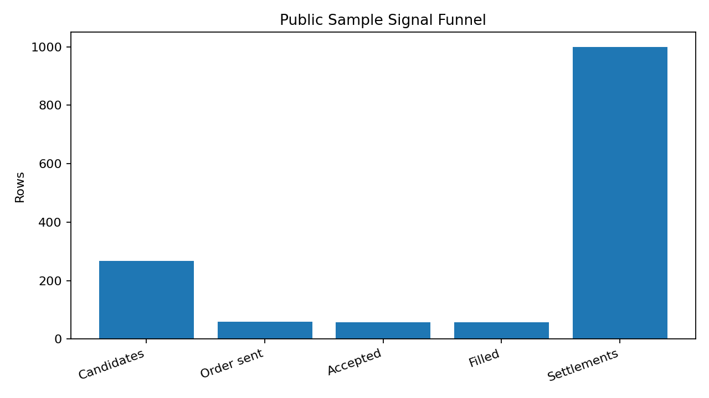
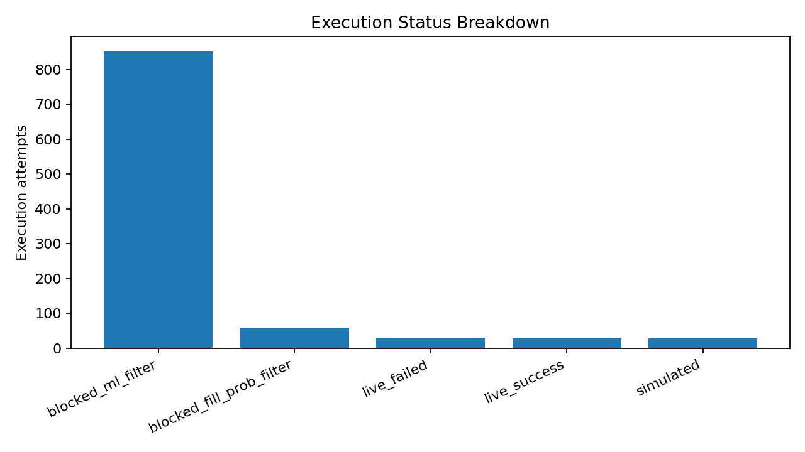
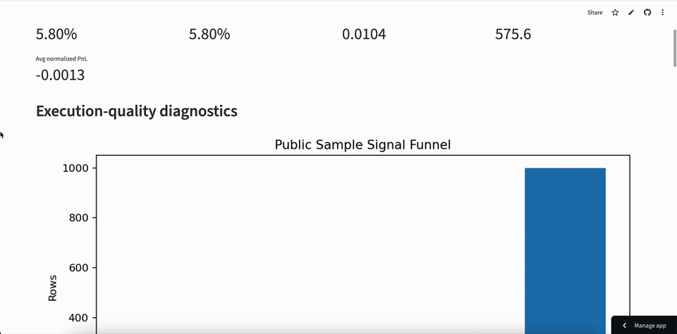

# Prediction Market Execution Lab

**Testing Executable Edge in Polymarket BTC Short-Horizon Markets**

[](https://www.python.org/)
[](https://github.com/astral-sh/uv)
[](https://docs.pytest.org/)
[](https://docs.astral.sh/ruff/)
[](https://streamlit.io/)
[](#)

Prediction Market Execution Lab is a public FinTech / market microstructure research project testing whether apparent prediction-market edge can survive the full path from signal detection to filled exposure and settlement.

**Key lesson:** short-horizon prediction-market edge is not only a pricing problem; it is an execution-quality problem.

This repository is **not** a trading bot, production execution system, or profitable strategy claim. It is a research portfolio project built around executable-edge analysis in Polymarket BTC short-horizon markets.

<div align="center">
  
</div>

## Author Note

Many people who know my work know that I have a strong interest in crypto, financial markets, and FinTech. Over the past ~100 days, I spent a significant amount of time studying prediction markets, with a particular focus on short-horizon Polymarket BTC markets.

The original private experiment started as an automated trading prototype. It did not produce a clear profitability breakthrough, and that became the most important lesson. During the process, I collected second-level order-book depth snapshots for five-minute BTC prediction markets, built tick-level replay datasets, tested multiple machine-learning approaches and parameter settings, and eventually integrated one selected model into the private research workflow.

What I learned was more valuable than a simple PnL result: apparent alpha can disappear quickly once spread, stale quotes, latency, failed fills, model gates, position constraints, and binary settlement risk are included. This public repository is the cleaned-up research version of that experience. It keeps the shareable analytics—fair probability modeling, executable-edge analysis, tick replay, execution diagnostics, calibration, ML filtering, and risk simulation—while excluding wallet, signer, allowance, live execution, private ledger, and strategy-sensitive details.

## Core Idea

The first layer of the project is a public-safe fair-probability estimate for a five-minute binary BTC market. The model asks whether the reference price is likely to finish above the market's opening anchor:

$$
\sigma_{\text{eff}}
= \sqrt{
    w_s\sigma_s^2
    + w_l\sigma_l^2
    + \sigma_{\min}^2
}
$$

$$
 z
 = \frac{\ln(P_t / P_0)}{\sigma_{\text{eff}}\sqrt{\tau}}
$$

$$
P_{\text{fair, UP}} = \Phi\left(\operatorname{clip}(z, -z_{\max}, z_{\max})\right)
$$

$$
P_{\text{fair, DOWN}} = 1 - P_{\text{fair, UP}}
$$

where \(P_t\) is the current BTC reference price, \(P_0\) is the opening-anchor price, \(\tau\) is remaining time to resolution, \(\sigma_s\) and \(\sigma_l\) are short- and long-window volatility estimates, and \(\Phi\) is the standard normal CDF.

From there, the research question becomes execution-aware:

$$
\text{theoretical edge} = P_{\text{fair}} - P_{\text{market}}
$$

$$
\text{executable edge}
\approx
\text{theoretical edge}
- \text{spread}
- \text{slippage}
- \text{latency/fill-risk cost}
- \text{settlement error}
$$

The central question is not whether a signal can look good in isolation. It is whether that signal can survive the full execution path and still become reliable filled exposure.

## What Changed My Mind

In the first 10--15 days of research, a simple tick-replay simulation looked much better than I expected. Replaying historical market states against my own price and probability model produced strong simulated results, which made the early phase of the project genuinely exciting.

The gap appeared once I moved from replay to real-money execution. Live trading exposed frictions that the simple simulation did not fully capture: network latency, random Polymarket API response delays, stale order-book updates, and late-market reversals that became visible around the 20th to 30th day of observation. The core bottleneck was no longer only prediction accuracy. It was execution quality.

That realization is why this repository is framed as an execution-quality research lab rather than a trading bot showcase.

## Why This Public Version Is Safe

The original private prototype contained sensitive operational details, including public wallet addresses, on-chain order hashes, private data logs, probability-calibration parameters, and machine-learning configuration choices. Those details are not suitable for a public repository.

This public version keeps only the research components that can be shared safely: anonymized tick records, reference-price data, simplified order records, public-safe model outputs, reports, notebooks, and dashboard artifacts. Identifiable private data and live execution details have been removed so the project can be used for learning, review, and discussion without exposing production trading operations.

## TL;DR

| Question | Answer |
|---|---|
| What did I test? | Whether short-horizon Polymarket BTC pricing edge remains tradable after execution frictions. |
| What did I find? | The public sample does not support a profitability claim; the strategy did not yet convert theoretical edge into reliable realized PnL. |
| Why does it matter? | Pure tick replay can look positive, but live-like execution records become weaker after latency, quote staleness, failed order submission, fill probability, model gates, and settlement outcomes. |
| Core contribution | A public-safe research workflow for separating theoretical edge from executable edge. |

## Key Findings

1. **Simulation-to-live gap is the central problem.**  
   Pure tick replay can show positive edge, but live-like ledger records gave a different answer after order-submission failure, latency, quote staleness, fill probability, model gates, and settlement outcomes were included.

2. **The bottleneck is the execution funnel, not only spread.**  
   Spread matters, but the larger issue is whether a signal survives acceptance, fill probability, ML EV filtering, order submission, and settlement.

3. **Extreme probability buckets are fragile.**  
   Very low and very high probability buckets are less stable in the public sample, especially around the final resolution window where small price changes can cause large binary-outcome errors.

4. **ML is an execution-quality gate, not a magic alpha model.**  
   The private workflow uses ML EV and fill-probability gates to improve candidate quality after edge detection. The public demo exports only safe scalar diagnostics and does not ship model artifacts or raw feature JSON.

5. **Risk is sparse and path-dependent.**  
   The public sample looks zero-inflated rather than like smooth edge capture: many markets produce no positive normalized PnL because the strategy often does not form a matched position.

## Explore the Project

| Artifact | Description |
|---|---|
| [Portfolio Page](https://pm-lab.kylekkkk.com/) | Static public portfolio landing page for the project. |
| [Live Dashboard](https://prediction-market-execution-lab-4byaayq2atzengbe26nkfb.streamlit.app/) | Streamlit dashboard for public-sample execution diagnostics. |
| [`reports/execution_quality_report.md`](reports/execution_quality_report.md) | Signal funnel, rejection reasons, edge before/after execution, settlement PnL, author takeaways. |
| [`reports/probability_calibration_report.md`](reports/probability_calibration_report.md) | Fair probability vs market-implied calibration, tail-bucket instability, Binance reference-price assumption. |
| [`reports/ml_filter_report.md`](reports/ml_filter_report.md) | ML EV gate, fill-probability diagnostics, walk-forward validation, overfitting limitations. |
| [`reports/risk_simulation_report.md`](reports/risk_simulation_report.md) | Monte Carlo terminal PnL, drawdown, losing-streak, and path-dependency diagnostics. |
| [`notebooks/`](notebooks/) | Six-notebook research walkthrough covering sample data, execution quality, reference price, calibration, ML diagnostics, and risk simulation. See the [`notebooks/README.md`](notebooks/README.md) guide. |
| [`docs/methodology.md`](docs/methodology.md) | Methodology details, fair probability formula, reference-price assumptions, gate sequence. |
| [`docs/limitations.md`](docs/limitations.md) | Scope limits, replay/live gap, reference-lag assumption, ML/filter caveats. |

## Visual Summary

<div align="center">
  <br>
  <em>Research workflow: public sample data moves through probability modeling, edge calculation, execution diagnostics, reports, notebooks, dashboard, and risk simulation.</em>
</div>

<br>

<table align="center">
  <tr>
    <td align="center">
      <br>
      <em>Most candidate signals do not become filled exposure.</em>
    </td>
    <td align="center">
      <br>
      <em>Execution states explain where public-sample attempts fail.</em>
    </td>
  </tr>
</table>

## Dashboard Preview

The live dashboard follows a five-step review flow: overview, execution funnel, probability calibration, ML/fill diagnostics, and report/sample-table inspection.

<div align="center">
  
</div>

## Research Question

> Can apparent short-horizon prediction-market pricing edges survive real execution frictions such as bid-ask spread, slippage, fill probability, latency, position limits, and settlement outcomes?

The project separates two concepts: **theoretical edge**, the difference between a fair probability estimate and a market-implied probability; and **executable edge**, the portion that remains after execution frictions and settlement outcomes are incorporated.

## Why Prediction Markets

Prediction-market prices can be interpreted as market-implied probabilities, which makes them useful for studying the gap between estimated fair probability and executable outcomes. Short-horizon BTC markets are especially useful because they combine fast reference-price movement, binary settlement, CLOB bid-ask dynamics, time-to-resolution effects, liquidity constraints, and final-window reversal risk.

The fair-probability workflow uses Binance BTCUSDT spot ticks as the faster reference layer and Binance-derived bucket open prices as the opening-anchor proxy. Polymarket BTC markets settle against an oracle-style reference rather than Binance directly. My working assumption, consistent with common player observations in these markets, is that the resolution-linked reference tends to follow Binance-style spot movement with a short delay. This repository does not yet include a dedicated lead-lag validation study, so the lag is treated as a domain-informed assumption rather than a proven empirical claim.

## Methodology Snapshot

```text
public sample data
→ fair probability and market-implied probability analysis
→ candidate edge calculation
→ tick replay and execution-quality diagnostics
→ ML EV / fill-probability gate diagnostics
→ sample-backed reports and figures
→ Monte Carlo risk simulation
→ Streamlit dashboard
```

Main components:

| Component | What it answers |
|---|---|
| Fair probability modeling | What would a reference-price model estimate as the fair outcome probability? |
| Executable edge calculation | How much apparent edge remains after spread, slippage, fill probability, and execution assumptions? |
| Tick-level replay | Would the signal remain actionable under historical quote snapshots? |
| Execution-quality diagnostics | Where do candidate signals fail: rejection, no-fill, latency, edge decay, or settlement? |
| Probability calibration | Do fair and market-implied probabilities align with realized outcomes in the public sample? |
| ML / fill-probability gates | Do public-safe scalar diagnostics help separate higher-quality candidates from weak ones? |
| Risk simulation | How sparse, path-dependent, and drawdown-sensitive are normalized public-sample outcomes? |

See [`docs/methodology.md`](docs/methodology.md) for the full methodology.

## Skills Demonstrated

- **Market microstructure reasoning:** separate theoretical pricing edge from executable exposure.
- **Probability modeling:** estimate fair probability and compare it with market-implied probability.
- **Execution-quality diagnostics:** analyze spread, fill probability, latency, rejected orders, failed fills, and settlement outcomes.
- **Backtesting discipline:** compare positive tick-replay results with weaker live-like execution records.
- **ML evaluation:** use ML EV and fill-probability gates as signal-quality filters rather than profit guarantees.
- **Risk analysis:** use Monte Carlo simulation to inspect sparse, path-dependent PnL outcomes.
- **Public-safe research engineering:** convert private trading experiments into anonymized reports, notebooks, dashboards, and portfolio artifacts.

## Tech Stack

| Area | Tools / Methods |
|---|---|
| Language | Python 3.11+ |
| Environment | `uv`, `pyproject.toml`, `uv.lock` |
| Data workflow | pandas, NumPy, public-safe anonymized CSV samples |
| Probability modeling | fair probability model, implied probability handling, calibration diagnostics |
| Backtesting | tick-level replay, execution-quality simulation |
| ML diagnostics | public-safe ML EV gate, fill-probability gate, chronological validation workflow |
| Risk | Monte Carlo / bootstrap simulation, drawdown and losing-streak diagnostics |
| Visualization | matplotlib report figures, Streamlit dashboard |
| Quality | pytest, ruff |

## Data and Sample Policy

Private raw ledger data, raw tick snapshots, wallet identifiers, order IDs, signer logic, allowance logic, deployment details, live execution runbooks, raw model artifacts, and feature JSON are intentionally excluded from the public workflow.

Public sample files under [`data/sample/`](data/sample/) are:

- anonymized
- downsampled
- normalized where needed
- small enough for review and deterministic demo runs
- intended for reproducible demonstrations, not full historical analysis

Public sample files:

```text
data/sample/candidates_sample.csv
data/sample/executions_sample.csv
data/sample/rejections_sample.csv
data/sample/settlements_sample.csv
data/sample/tick_snapshots_sample.csv
```

The sample-generation policy is documented in [`docs/data_preparation.md`](docs/data_preparation.md), and the sample schema is documented in [`docs/sample_data_schema.md`](docs/sample_data_schema.md).

## Quickstart

Install the environment, run tests, and launch the public-sample dashboard:

```bash
uv sync --extra dev --extra notebook --extra dashboard --extra ml
PYTHONPATH=src uv run pytest
PYTHONPATH=src uv run streamlit run dashboard/app.py
```

The dashboard reads only public sample files and generated report artifacts from the repository. It does not connect to live markets, private ledgers, wallets, signers, or execution APIs.

<details>
<summary>Regenerate reports and figures</summary>

```bash
PYTHONPATH=src uv run python scripts/run_execution_quality_report.py
PYTHONPATH=src uv run python scripts/run_probability_calibration_report.py
PYTHONPATH=src uv run python scripts/run_monte_carlo_simulation.py
PYTHONPATH=src uv run python scripts/run_ml_filter_demo.py
PYTHONPATH=src uv run python scripts/generate_report_figures.py
```

</details>

<details>
<summary>Run optional demos and local sample preparation</summary>

Optional tick replay demo:

```bash
PYTHONPATH=src uv run python scripts/run_tick_replay_backtest.py
```

Optional public sample regeneration from local private inputs:

```bash
PYTHONPATH=src uv run python scripts/prepare_public_sample_data.py
```

Sample regeneration requires local private raw inputs that are excluded from the repository. Do not commit files under `private/`.

</details>

## Repository Structure

```text
prediction-market-execution-lab/
├── data/sample/                  # Public-safe anonymized and downsampled demo datasets
├── docs/                         # Project brief, methodology, architecture, limitations, data notes
├── reports/                      # Demonstration reports and generated figures
├── scripts/                      # Demo-safe report, figure, sample, and simulation runners
├── src/                          # Public research modules
│   ├── backtesting/              # Tick-level replay logic
│   ├── data_sources/             # Public sample loading and local source-inspection helpers
│   ├── execution_quality/        # Edge and fill-quality calculations
│   ├── models/                   # Fair probability, calibration, and ML-filter demos
│   ├── risk/                     # Monte Carlo risk simulation
│   └── utils/                    # Anonymization and shared utilities
├── tests/                        # Unit tests for public-safe modules and scripts
├── dashboard/                    # Streamlit public-sample demo dashboard
├── pyproject.toml                # Project metadata and dependencies
└── uv.lock                       # Locked environment
```

## Limitations

This repository is designed for transparent research demonstration. Important limitations include:

- Public samples are anonymized, downsampled, and normalized.
- Demonstration reports do not represent complete historical empirical performance.
- Backtests and tick replays are not equivalent to live execution.
- Fill assumptions may differ from actual venue behavior.
- Latency, quote staleness, market-depth changes, and order-submission failure can materially alter realized outcomes.
- ML-assisted filtering can overfit and must be validated out of sample before any serious use.
- The project does not include wallet operations, signer logic, live taker execution, allowance maintenance, auto-claim logic, or production deployment instructions.

See [`docs/limitations.md`](docs/limitations.md) for more detail.

## Disclaimer

This project is for research, educational, and portfolio demonstration purposes only. It is not financial advice, trading advice, investment advice, or a recommendation to participate in any market.

The repository does not claim to provide a profitable strategy, does not claim to predict BTC, and does not provide a live trading or betting system. All public outputs should be interpreted as demonstration-only analysis built on public-safe sample data.
