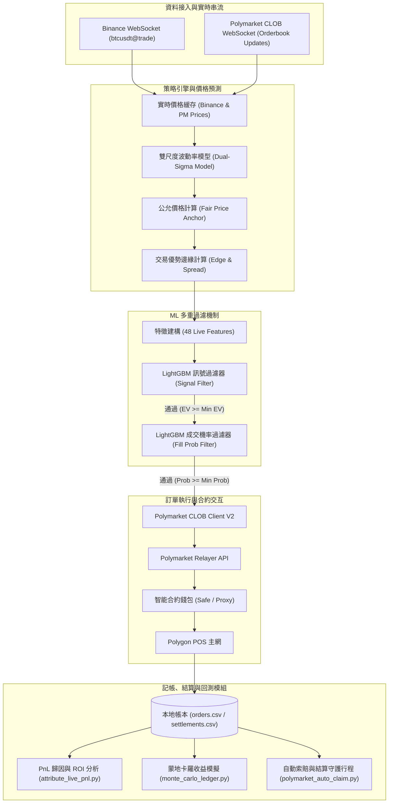

# Polymarket Taker Bot (PMXT) ⚡

[](https://www.python.org/)
[](https://polygon.technology/)
[](https://github.com/polymarket/clob-api-sdk)
[](LICENSE)

本專案是一個基於 **Polymarket CLOB V2** 協議開發的高頻 Taker 交易系統。專門針對高波動的 BTC 漲跌二元期權市場（如 `btc-updown-5m` 和 `btc-updown-15m`）進行毫秒級的實時差價套利與方向性預測交易。

系統融合了**雙尺度波動率定價模型 (Dual-Sigma Volatility Model)**、**LightGBM 機器學習訊號過濾**與**成交機率預測模型**，並配備完整的鏈上自動索賠結算（Auto Claim）、授權維護（Allowance Maintenance）及蒙地卡羅回測歸因工具，是專為生產環境設計的工業級量化交易方案。

---

## 📐 系統架構與資料流 (System Architecture)

系統採用非同步非阻塞異步架構 (`asyncio`)，實時接入 Binance 與 Polymarket 的雙重 WebSocket 串流，其核心運作流程如下：



---

## 🗂️ 模組導覽 (Directory Structure)

專案結構清晰，將策略核心、輔助工具、機器學習和回測環境高度模組化：

### 核心模組
*   **[bot.py](file:///Users/kyle/Downloads/Polymarket-Taker-Bot/bot.py)**: 系統進入點。實時 WebSocket 串流監聽、策略計算、以及 Taker 交易訂單提交的核心守護進程。
*   **[ml_filter.py](file:///Users/kyle/Downloads/Polymarket-Taker-Bot/ml_filter.py)**: LightGBM 機器學習過濾引擎，負責將運行時收集的 48 個即時特徵（如歷史勝率、ROI、時間戳等）傳入模型，計算預期價值（EV）與成交機率。

### 鏈上維護與結算
*   **[polymarket_auto_claim.py](file:///Users/kyle/Downloads/Polymarket-Taker-Bot/polymarket_auto_claim.py)**: 自動索賠模組。定時掃描交易帳本，對已結束的市場通過 Polymarket Relayer 提交 `redeemPositions` 智能合約多重呼叫，將贏得的頭寸自動兌換為 pUSD / USDC 鎖定利潤。
*   **[polymarket_allowance_maintenance.py](file:///Users/kyle/Downloads/Polymarket-Taker-Bot/polymarket_allowance_maintenance.py)**: 錢包額度授權工具。檢測並自動提交 pUSD 額度授權給 Polymarket 的交易合約（CTF Collateral Adapter），防範因 Allowance 不足導致下單失敗。

### 機器學習訓練與驗證
*   **[build_ml_signal_dataset.py](file:///Users/kyle/Downloads/Polymarket-Taker-Bot/build_ml_signal_dataset.py)**: 自定義特徵工程腳本，將歷史 Tick 快照轉換為適用於 LGBM 訓練的特徵資料集。
*   **[train_ml_filter.py](file:///Users/kyle/Downloads/Polymarket-Taker-Bot/train_ml_filter.py)**: LightGBM 訊號模型訓練腳本。
*   **[train_live_candidate_model.py](file:///Users/kyle/Downloads/Polymarket-Taker-Bot/train_live_candidate_model.py)**: 成交機率模型訓練腳本。
*   **[validate_ml_on_live_executions.py](file:///Users/kyle/Downloads/Polymarket-Taker-Bot/validate_ml_on_live_executions.py)**: 將實戰執行日誌與 ML 預測特徵進行對齊驗證，確保線上特徵與線下無偏差。

### 記帳與回測歸因
*   **[attribute_live_pnl.py](file:///Users/kyle/Downloads/Polymarket-Taker-Bot/attribute_live_pnl.py)**: 歸因分析模組。按時間段、訊號類型、交易優勢等維度深入剖析實盤帳本的 ROI 及勝率。
*   **[monte_carlo_ledger.py](file:///Users/kyle/Downloads/Polymarket-Taker-Bot/monte_carlo_ledger.py)**: 基於真實交易歷史與拒絕信號的蒙地卡羅模擬器，分析極端滑價與不同策略變數下的收益分佈與最大回撤。
*   **[backtest_ticks.py](file:///Users/kyle/Downloads/Polymarket-Taker-Bot/backtest_ticks.py) / [backtest_ml_filter.py](file:///Users/kyle/Downloads/Polymarket-Taker-Bot/backtest_ml_filter.py)**: 高頻 Tick 級離線回測系統，支持完整重播訂單簿與價格變化。

---

## ⚙️ 配置指南 (.env Configuration)

系統參數完全環境變數化。請參考以下分類配置您的 `.env` 檔案（範本見 `[.env.example](file:///Users/kyle/Downloads/Polymarket-Taker-Bot/.env.example)`）：

### 1. 交易核心參數 (Taker Settings)
| 變數名稱 | 默認值 | 說明 |
| :--- | :--- | :--- |
| `TRADE_AMOUNT_USD` | `1.0` | 每次下單的目標金額（USD） |
| `MARKET_BUCKET_MINUTES` | `15` | 目標市場時間長度（支援 `5` 或 `15` 分鐘） |
| `EDGE_PROB_THRESHOLD` | `0.18` | 觸發交易的最小公允價差（Edge）門檻 |
| `EDGE_REFERENCE_PRICE` | `ask` | 價差計算參考價（`bid` 或 `ask`） |
| `COOLDOWN_SECONDS` | `3` | 同一市場下單間隔冷卻時間（秒） |
| `MAX_SPREAD` | `0.02` | 允許交易的 Polymarket 最大買賣價差 |
| `DRY_RUN` | `true` | 是否開啟模擬交易模式（不真正提交訂單） |
| `TAKER_ORDER_TYPE` | `FOK` | 訂單類型：`FOK` (Fill-or-Kill) 或 `FAK` (Fill-and-Kill) |
| `EXEC_PRICE_MODE` | `hybrid` | 執行價格模式（`book`, `edge`, `hybrid` 或 `market`） |

### 2. 雙尺度波動率模型 (Dual-Sigma Volatility Model)
| 變數名稱 | 默認值 | 說明 |
| :--- | :--- | :--- |
| `VOL_WINDOW_SHORT_SECONDS` | `20` | 短週期波動率滾動視窗（秒） |
| `VOL_WINDOW_LONG_SECONDS` | `80` | 長週期波動率滾動視窗（秒） |
| `SIGMA_SHORT_WEIGHT` | `0.75` | 短週期波動率權重 |
| `SIGMA_LONG_WEIGHT` | `0.25` | 長週期波動率權重 |
| `SIGMA_MIN` | `0.000015` | 最小波動率地板限制，防範定格時定價失真 |
| `TAU_FLOOR_SECONDS` | `5` | 離到期時間的地板值，避免臨界點分母歸零 |
| `Z_CAP` | `6.0` | Z 分數（標準差偏離值）硬上限限制 |

### 3. LightGBM 訊號與成交率過濾 (ML Filters)
> [!NOTE]
> 建議在非同步回測報告顯示回測回報率優於基準後，再於實盤啟用 `ML_FILTER_ENABLED=true`。

```ini
# ML 訊號過濾 (預測 EV)
ML_FILTER_ENABLED=false
ML_FILTER_MODEL_PATH=models/signal_filter_lgbm_v1.txt
ML_FILTER_FEATURES_PATH=models/signal_filter_lgbm_v1_features.json
ML_FILTER_MIN_EV=0.0
ML_FILTER_FAIL_OPEN=false

# 成交率過濾
FILL_PROB_FILTER_ENABLED=true
FILL_PROB_MODEL_PATH=models/live_candidate_research_weekdays_2026-05-21_30/fill_probability_model.txt
FILL_PROB_FEATURES_PATH=models/live_candidate_research_weekdays_2026-05-21_30/features.json
FILL_PROB_MIN_PROBABILITY=0.75
```

### 4. 鏈上身份與錢包設置 (Web3 & Relayer Credentials)
```ini
# 您的 MetaMask/EOA 私鑰（用於簽名）
PRIVATE_KEY=your_private_key_here

# 您的 Polymarket Proxy/Safe 錢包地址
FUNDER_ADDRESS=your_safe_wallet_address_here
POLY_SIGNATURE_TYPE=2          # 1: Proxy, 2: Safe
CLAIM_RELAYER_TX_TYPE=SAFE     # SAFE 或 PROXY

# 從 Polymarket Settings > API Keys 申請的 Relayer 金鑰
RELAYER_API_KEY=your_relayer_api_key
RELAYER_API_KEY_ADDRESS=your_relayer_api_key_address
RELAYER_URL=https://relayer-v2.polymarket.com
CLOB_HOST=https://clob.polymarket.com
```

---

## 🚀 部署與維運 (Deployment & Runbook)

專案配備了基於 `systemd` 的一鍵部署指令碼 `[deploy.sh](file:///Users/kyle/Downloads/Polymarket-Taker-Bot/deploy.sh)`。

### 一鍵安裝與啟動
1. 確保 `.env` 已正確填寫。
2. 執行部署指令碼：
   ```bash
   sudo chmod +x deploy.sh
   sudo ./deploy.sh
   ```
   *該指令碼會自動建立名為 `botenv` 的虛擬環境、下載最新依賴、寫入 systemd 設定檔並重新載入服務。*

### systemd 服務說明
系統將拆分為兩個獨立守護進程運行，以實現「交易」與「索賠」的關注點分離：
*   **`pm-taker-v2.service`**: 實時交易主 Bot。
*   **`pm-claim-v2.service`**: 非同步自動索賠 Watcher。

### 常用維運指令

#### 服務狀態查詢
```bash
# 查看交易 Bot 運行狀態
systemctl status pm-taker-v2.service

# 查看索賠 Watcher 運行狀態
systemctl status pm-claim-v2.service
```

#### 日誌追蹤
```bash
# 實時追蹤交易日誌
tail -f bot.log

# 實時追蹤索賠日誌
tail -f claim.log
```

#### 啟停與重啟
```bash
# 重啟交易 Bot
systemctl restart pm-taker-v2.service

# 停止交易 Bot
systemctl stop pm-taker-v2.service
```

#### 手動應急操作
```bash
# 立即強制執行一次鏈上頭寸索賠
./botenv/bin/python polymarket_auto_claim.py run-once

# 檢查並將 pUSD 授權額度手動更新為 1000 pUSD
./botenv/bin/python polymarket_allowance_maintenance.py --approve-pusd 1000 --sync
```

---

## ⚠️ 核心運維與交易規範 (Operating Rules)

> [!IMPORTANT]
> 請交易員與系統管理員嚴格遵守以下生產環境運行規範：
>
> 1.  **禁交週末市場**: 生產環境運作規範已明示，**禁止交易週末到期的合約**（週末市場通常深度極差且價格偏離易失真，歷史數據證明週末交易呈現顯著負期望值）。除非明確取得最新數據分析支持並修改設定，否則請保持該禁令。
> 2.  **維護 Allowance 授權**: 啟動 Bot 前或充值後，必須執行 `polymarket_allowance_maintenance.py` 檢查 pUSD 額度授權，確保 Spender 地址擁有足夠的 ERC20 交易扣款權限。
> 3.  **單筆交易規模**: 預設單筆規模為 `$1.0` 至 `$12.0`。如需調大資金規模，必須預先對成交機率過濾器（`FILL_PROB_FILTER_ENABLED`）的閾值進行靈敏度分析，避免因滑價過大遭受損失。
> 4.  **注意 CLOB HOST 配置**: V2 正式上線後，VPS 生產環境的 `CLOB_HOST` 必須指向 `https://clob.polymarket.com`。

---

## 📈 記帳數據分析與可視化 (Attribution & Analysis)

運行一段時間後，本地 `ledger/` 目錄會生成 `orders.csv` 和 `market_settlements.csv`。你可以利用 PnL 歸因腳本進行複盤：

```bash
# 生成詳細的 ROI、勝率、不同優勢區間的 PnL 歸因 Markdown 報告與 CSV 統計
./botenv/bin/python attribute_live_pnl.py \
  --ledger-dir ledger \
  --report-md analysis/pnl_report.md
```

報告將輸出至 `[analysis/pnl_report.md](file:///Users/kyle/Downloads/Polymarket-Taker-Bot/analysis/pnl_report.md)`，其包含最優盈利特徵組與最差虧損特徵組，供持續迭代 LightGBM 過濾器參數。
