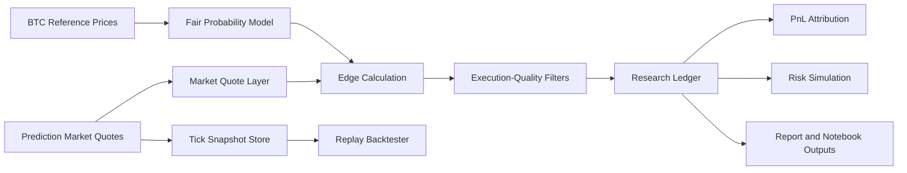

# Architecture

This document outlines the planned public architecture for Prediction Market Execution Lab.

## High-Level Flow

## Planned Public Modules

- `src/data_sources/`: data loading and sample quote ingestion
- `src/models/`: fair probability and optional ML filter logic
- `src/execution_quality/`: spread, edge, fill, and attribution analysis
- `src/backtesting/`: tick replay and walk-forward research utilities
- `src/risk/`: Monte Carlo and path-risk utilities
- `src/utils/`: shared configuration and plotting helpers

## Current Status

This is a scaffold. Module names may change as prototype code is migrated into the public research structure.
