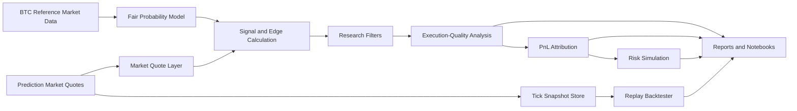

# Architecture

This document outlines the public architecture for the research version of the project.

The repository is now organized around public-safe modules, demo scripts, sample-backed reports, notebooks, and a Streamlit dashboard. Root-level legacy execution and research scripts are not part of the public demo surface.

## System Flow



## Repository Structure

```text
src/
├── data_sources/
│   ├── binance.py
│   └── polymarket.py
├── models/
│   ├── fair_probability.py
│   └── ml_filter.py
├── execution_quality/
│   ├── edge.py
│   ├── spread.py
│   ├── fill_analysis.py
│   └── pnl_attribution.py
├── backtesting/
│   ├── tick_replay.py
│   └── walk_forward.py
├── risk/
│   └── monte_carlo.py
└── utils/
    ├── config.py
    └── plotting.py
```

## Public-Safe Boundary

The public architecture avoids direct wallet operations, production deployment scripts, private execution runbooks, raw private trading records, and tracked private model artifacts. Demo workflows run on anonymized, downsampled, normalized sample data.
