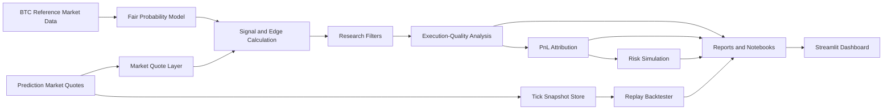

# Architecture

This document outlines the public architecture for Prediction Market Execution Lab.

The repository is organized around public-safe modules, demo scripts, sample-backed reports, notebooks, and a Streamlit dashboard.

## System Flow



## Repository Structure

```text
src/
├── data_sources/          # Public sample loading and private schema inspection helpers
├── models/                # Fair probability, calibration, and ML-filter demos
├── execution_quality/     # Edge, spread, fill, and PnL diagnostics
├── backtesting/           # Tick-level replay logic
├── risk/                  # Monte Carlo risk simulation
└── utils/                 # Anonymization and shared utilities
```

Public scripts under `scripts/` generate reports, figures, sample data, and local inspection summaries. The dashboard under `dashboard/` reads only public sample files and generated report artifacts.

## Public-Safe Boundary

The public architecture avoids direct wallet operations, production deployment scripts, private execution runbooks, raw private trading records, and private model artifacts. Demo workflows run on anonymized, downsampled, normalized sample data.
