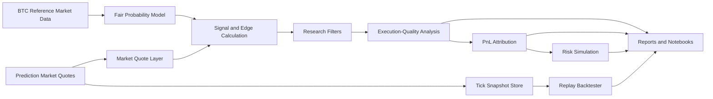

# Architecture

This document outlines the planned public architecture for the research version of the project.

The current repository is still in migration. Some legacy scripts may remain in the root directory until their public-safe logic is extracted into `src/`.

## Planned System Flow



## Planned Repository Structure

```text
src/
├── data_sources/
│   ├── binance.py
│   └── polymarket.py
├── models/
│   ├── fair_probability.py
│   └── ml_filter.py
├── execution_quality/
│   ├── edge.py
│   ├── spread.py
│   ├── fill_analysis.py
│   └── pnl_attribution.py
├── backtesting/
│   ├── tick_replay.py
│   └── walk_forward.py
├── risk/
│   └── monte_carlo.py
└── utils/
    ├── config.py
    └── plotting.py
```

## Migration Notes

Public modules should be extracted from legacy scripts gradually.

The public architecture should avoid direct wallet operations, production deployment scripts, private execution runbooks, and raw private trading records.
