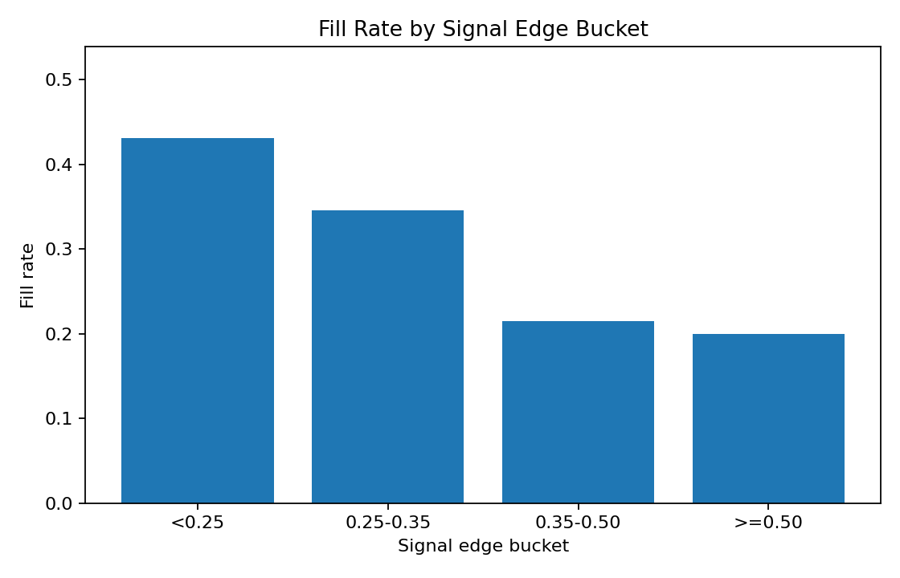
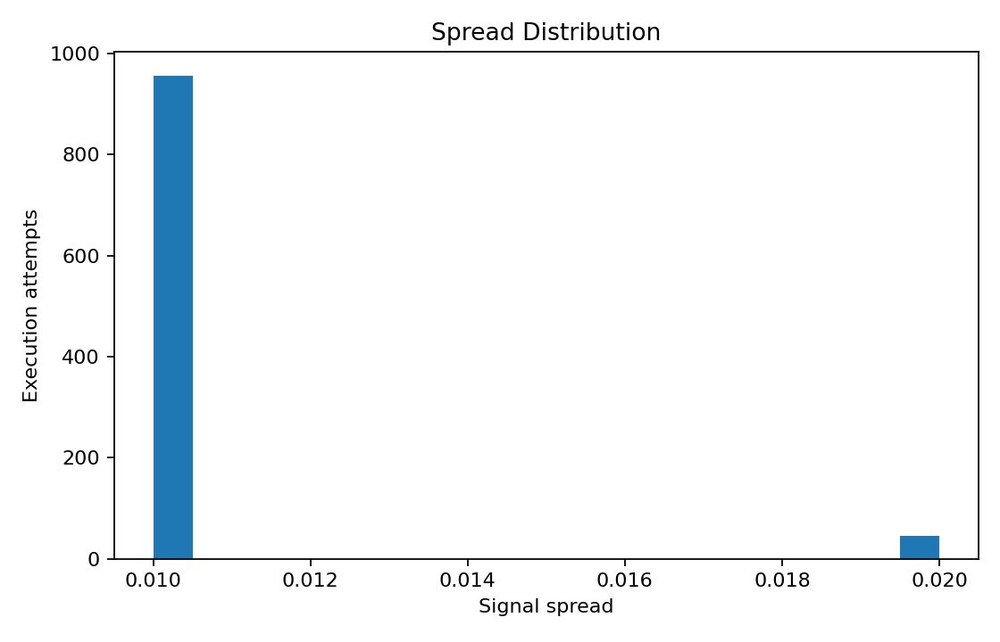

# Execution Quality Report

> This report is generated from anonymized public sample data. It is a reproducible demo report, not a claim about complete live performance.

## Research question

This report asks whether apparent short-horizon prediction-market edge survives the execution funnel. The central distinction is between a signal that looks attractive at quote time and a signal that remains executable after spread, latency, fill probability, rejection logic, and settlement outcomes are applied.

## Sample and data policy

The report uses public sample CSV files only. Candidate, execution, rejection, and settlement records are anonymized, downsampled, and field-filtered. Monetary scale is bucketed or normalized where needed, and private operational fields such as wallet identifiers, raw order IDs, signer details, model paths, and raw responses are excluded.

## Sample coverage

| Dataset | Rows |
|---|---:|
| Candidate signals | 268 |
| Execution attempts | 1000 |
| Signal rejections | 1000 |
| Market settlements | 1000 |

## Execution funnel

The funnel shows how many candidate signals remain after they pass through attempted execution, acceptance, fill, rejection, and settlement-style sample states. This is the key place where theoretical edge can disappear before it becomes executable edge.

- Accepted rate: **5.80%**
- Fill rate: **5.80%**

### Execution status breakdown

| Status | Count | Share |
|---|---:|---:|
| blocked_ml_filter | 852 | 85.20% |
| blocked_fill_prob_filter | 59 | 5.90% |
| live_failed | 31 | 3.10% |
| live_success | 29 | 2.90% |
| simulated | 29 | 2.90% |

## Rejection reason breakdown

Rejection categories identify where candidate signals fail before becoming executable. They should be interpreted as execution-quality diagnostics rather than as live trading rules.

| Reason | Count | Share |
|---|---:|---:|
| other | 643 | 64.30% |
| risk_limit | 357 | 35.70% |

## Grouped execution diagnostics

These grouped metrics are calculated on anonymized execution-attempt samples and are intended to diagnose execution quality by observable sample features.

### By side

| Group | Rows | Accepted rate | Fill rate | Avg signal edge | Avg spread | Avg latency ms |
|---|---:|---:|---:|---:|---:|---:|
| DOWN | 576 | 4.69% | 4.69% | 0.3212 | 0.0105 | 621.6 |
| UP | 424 | 7.31% | 7.31% | 0.3194 | 0.0104 | 501.7 |

### By time bucket

| Group | Rows | Accepted rate | Fill rate | Avg signal edge | Avg spread | Avg latency ms |
|---|---:|---:|---:|---:|---:|---:|
| 240-270 | 187 | 6.95% | 6.95% | 0.3414 | 0.0105 | 838.3 |
| 180-210 | 173 | 2.31% | 2.31% | 0.3133 | 0.0105 | 400.1 |
| 270-300 | 168 | 22.02% | 22.02% | 0.3705 | 0.0108 | 355.8 |
| 150-180 | 140 | 0.00% | 0.00% | 0.2995 | 0.0101 | 1040.3 |
| 210-240 | 115 | 2.61% | 2.61% | 0.3243 | 0.0105 | 537.5 |
| 120-150 | 95 | 1.05% | 1.05% | 0.2918 | 0.0100 | 343.9 |
| 90-120 | 61 | 0.00% | 0.00% | 0.2791 | 0.0103 | 504.4 |
| 60-90 | 35 | 0.00% | 0.00% | 0.2709 | 0.0100 | 401.0 |
| 30-60 | 20 | 0.00% | 0.00% | 0.2594 | 0.0105 | 641.6 |
| 0-30 | 6 | 0.00% | 0.00% | 0.2498 | 0.0117 | 2554.9 |

### By signal edge bucket

| Group | Rows | Accepted rate | Fill rate | Avg signal edge | Avg spread | Avg latency ms |
|---|---:|---:|---:|---:|---:|---:|
| 0.25-0.35 | 525 | 3.62% | 3.62% | 0.2863 | 0.0105 | 718.0 |
| <0.25 | 248 | 3.23% | 3.23% | 0.2443 | 0.0105 | 598.1 |
| 0.35-0.50 | 160 | 5.00% | 5.00% | 0.4154 | 0.0103 | 356.0 |
| >=0.50 | 67 | 34.33% | 34.33% | 0.6422 | 0.0106 | 366.4 |

### By spread bucket

| Group | Rows | Accepted rate | Fill rate | Avg signal edge | Avg spread | Avg latency ms |
|---|---:|---:|---:|---:|---:|---:|
| <=0.01 | 955 | 5.86% | 5.86% | 0.3202 | 0.0100 | 589.8 |
| 0.01-0.02 | 45 | 4.44% | 4.44% | 0.3245 | 0.0200 | 447.8 |

## Edge before and after execution

This section compares signal-time edge with an execution-adjusted estimate when the public sample contains the required fields. The difference is a direct diagnostic of how much apparent edge is eroded by fill assumptions and execution constraints.

| Metric | Value |
|---|---:|
| Rows with edge fields | 0 |
| Average signal edge | n/a |
| Average edge after fill estimate | n/a |
| Average edge decay | n/a |

## Candidate timing distribution

| Time bucket | Count | Share |
|---|---:|---:|
| 180-210 | 55 | 20.52% |
| 210-240 | 41 | 15.30% |
| 240-270 | 39 | 14.55% |
| 270-300 | 34 | 12.69% |
| 150-180 | 32 | 11.94% |
| 120-150 | 21 | 7.84% |
| 60-90 | 18 | 6.72% |
| 90-120 | 17 | 6.34% |
| 30-60 | 9 | 3.36% |
| 0-30 | 2 | 0.75% |

## Settlement PnL summary

Settlement PnL is reported in normalized public-sample units. It is useful for directionally understanding whether filtered signals translated into favorable outcomes, but it is not account-level PnL and should not be interpreted as complete strategy performance.

| Metric | Value |
|---|---:|
| Rows with normalized PnL | 1000 |
| Average normalized net PnL | -0.0013 |
| Minimum normalized net PnL | -0.2232 |
| Maximum normalized net PnL | 0.8313 |
| Positive normalized PnL rate | 6.80% |

## What the public sample suggests

These metrics are intended to demonstrate the analysis pipeline. The public sample is anonymized, downsampled, and field-filtered, so it should not be interpreted as full strategy performance.

In this public sample, normalized settlement PnL is weak and slightly negative on average, while the positive normalized PnL rate is low. This supports the central project lesson: visible signal edge is not equivalent to executable edge after acceptance, fill probability, timing, spread, latency, and settlement outcomes are incorporated.

## What cannot be concluded

- The report does not prove that a live strategy is profitable or unprofitable across all market regimes.
- The sample does not reconstruct full private account history, real capital constraints, fees, or every venue-level fill dynamic.
- Grouped diagnostics can show associations between sample features and outcomes, but they should not be read as causal proof.
- Live execution would require additional latency, market-depth, and operational-risk validation outside this public repository.
