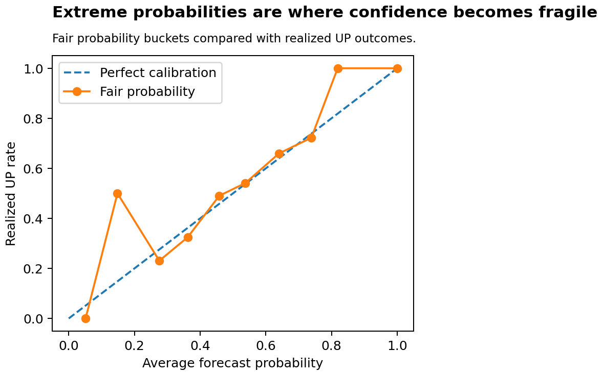

# Probability Calibration Report

> This report is generated from anonymized public sample data. It is a methodology and diagnostics artifact, not a claim about production predictive performance or trading profitability.

## Why calibration matters

Prediction-market prices can be read as market-implied probabilities, but a useful research model must also be calibrated against realized outcomes. Calibration diagnostics test whether forecast probabilities behave like probabilities rather than just producing directional scores.

## Fair probability vs market-implied probability

The report compares two probability sources when public sample fields are available: a model-estimated fair probability and a market-implied probability derived from prediction-market quotes. The comparison is diagnostic only; it does not establish that either source is consistently superior in live trading.

## Binance/reference price assumption

The fair-probability workflow uses Binance BTCUSDT-style reference prices as a high-frequency proxy for BTC spot movement. The motivation is that centralized exchange prices can update faster than prediction-market quotes and oracle- or settlement-linked references. This is a research assumption and diagnostic input, not proof of a persistent lead-lag alpha.

## Sample coverage

- Joined market-level observations: 986
- Forecast unit: one averaged forecast per anonymized market id
- Outcome unit: resolved UP/DOWN settlement side from public sample settlements
- If joined observations are zero, the current public sample does not contain aligned forecast and settlement keys

## Summary metrics

| Source | Observations | Brier score | Log loss |
|---|---:|---:|---:|
| Fair probability | 986 | 0.2378 | 0.6679 |
| Market-implied probability | 986 | 0.2358 | 0.6639 |

## How to read Brier score and log loss

Brier score measures squared probability error, where lower is better. Log loss penalizes confident wrong probabilities more severely, so it is sensitive to overconfident forecasts. Both metrics are computed only on joined public-sample observations.

## Fair probability calibration buckets

| Bucket | Count | Avg forecast | Realized rate | Avg abs error |
|---|---:|---:|---:|---:|
| 0.0-0.1 | 2 | 0.0513 | 0.0000 | 0.0513 |
| 0.1-0.2 | 2 | 0.1484 | 0.5000 | 0.3516 |
| 0.2-0.3 | 13 | 0.2758 | 0.2308 | 0.0450 |
| 0.3-0.4 | 111 | 0.3619 | 0.3243 | 0.0376 |
| 0.4-0.5 | 314 | 0.4584 | 0.4904 | 0.0321 |
| 0.5-0.6 | 377 | 0.5376 | 0.5411 | 0.0035 |
| 0.6-0.7 | 144 | 0.6402 | 0.6597 | 0.0195 |
| 0.7-0.8 | 18 | 0.7386 | 0.7222 | 0.0164 |
| 0.8-0.9 | 4 | 0.8187 | 1.0000 | 0.1813 |
| 0.9-1.0 | 1 | 1.0000 | 1.0000 | 0.0000 |

## Market-implied probability calibration buckets

| Bucket | Count | Avg forecast | Realized rate | Avg abs error |
|---|---:|---:|---:|---:|
| 0.0-0.1 | 1 | 0.0890 | 0.0000 | 0.0890 |
| 0.1-0.2 | 7 | 0.1793 | 0.1429 | 0.0364 |
| 0.2-0.3 | 51 | 0.2563 | 0.2941 | 0.0378 |
| 0.3-0.4 | 111 | 0.3584 | 0.4054 | 0.0470 |
| 0.4-0.5 | 288 | 0.4553 | 0.4375 | 0.0178 |
| 0.5-0.6 | 268 | 0.5456 | 0.5709 | 0.0253 |
| 0.6-0.7 | 182 | 0.6467 | 0.6374 | 0.0094 |
| 0.7-0.8 | 68 | 0.7356 | 0.6912 | 0.0444 |
| 0.8-0.9 | 8 | 0.8217 | 0.7500 | 0.0717 |
| 0.9-1.0 | 2 | 0.9565 | 1.0000 | 0.0435 |

## What calibration can suggest

Calibration buckets can show whether forecasts are systematically too high or too low in parts of the probability range. In this public sample, they should be treated as a workflow demonstration because the data is anonymized, downsampled, and collapsed to market-level observations.

## What calibration cannot prove

- Calibration metrics do not prove executable edge or profitability.
- Averaging multiple tick rows into one market-level observation removes intra-market timing information.
- A well-calibrated probability can still fail after spread, fill probability, latency, or position limits.
- A poor public-sample calibration result may reflect sample construction, limited observations, or anonymization rather than a general model failure.

## Interpretation notes

- Brier score and log loss are computed on public-sample market-level observations only.
- Markets with missing probabilities, unresolved settlement labels, or non-aligned anonymized keys are excluded.
- Multiple tick rows per market are averaged before scoring, so markets with more quote updates do not dominate the calibration score.
- The public sample is anonymized and downsampled; these diagnostics should be read as a reproducible workflow demonstration, not as a full empirical conclusion.
