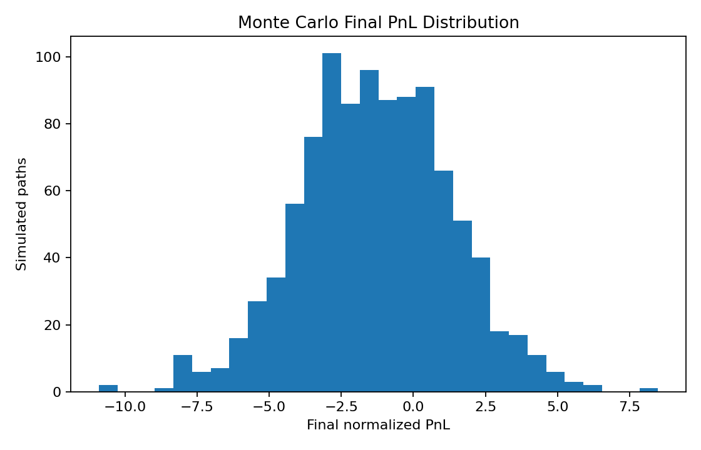
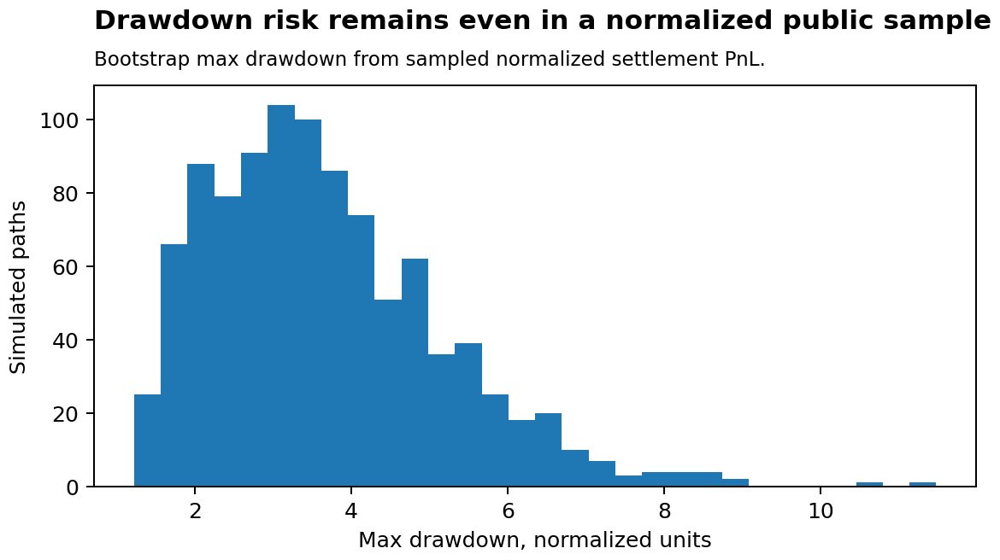

# Risk Simulation Report

This report is generated from anonymized public sample data only. All PnL values are normalized sample units, not real currency PnL, and should not be interpreted as live trading performance.

## Why Monte Carlo is included

Execution-quality analysis can show average outcomes, but average PnL is not enough to understand risk. A strategy or research signal can have weak mean performance, unstable path dependency, long losing streaks, or downside tails that are hidden by point estimates. Monte Carlo simulation is included to inspect the distribution of possible sample paths under resampling assumptions.

## Input sample distribution

The simulation bootstraps normalized public-sample PnL observations with replacement. This preserves the empirical public-sample outcome distribution while randomizing order across simulated paths. It does not reconstruct trade sizing, account equity, or live execution state.

| Metric | Value |
|---|---:|
| Normalized PnL observations | 1000 |
| Monte Carlo simulations | 1000 |
| Path horizon | 1000 |
| Random seed | 42 |

## Final normalized PnL distribution

| Metric | Value |
|---|---:|
| Mean final PnL | -1.3117 |
| Median final PnL | -1.3404 |
| 5th percentile final PnL | -5.4459 |
| 95th percentile final PnL | 2.8680 |

## How to read terminal PnL dispersion

The 5th and 95th percentile terminal PnL values describe downside and upside dispersion across resampled public-sample paths. Wide dispersion means realized path order can matter even when the same set of normalized outcomes is used.

## Drawdown and losing-streak diagnostics

| Metric | Value |
|---|---:|
| Mean max drawdown | 3.6700 |
| 95th percentile max drawdown | 6.4877 |
| Mean longest losing streak | 3.87 |
| 95th percentile longest losing streak | 5.00 |

## Author takeaway

The simulation reinforces the same conclusion as the execution report: the public sample does not look like smooth edge capture. Pure tick replay and simulated backtests can show positive edge, but the live-like ledger sample gives a different answer once failed order submission, latency, quote staleness, API variability, fill probability, and execution gates are included. The seven-day public sample is short and based on live-like execution records, so it naturally looks sparse and zero-inflated. This simulation-to-live gap is the core experiment of the project: aligning replayed edge with realized executable performance.

## Downside-risk interpretation

Drawdown and losing-streak statistics show how unfavorable sample paths can compound. They are especially important for short-horizon execution strategies because many small negative outcomes can accumulate before any large positive outcome appears.

## Execution-assumption sensitivity

These results are sensitive to what enters the public PnL sample. If fill probability, slippage, latency, fees, or position limits change, the input outcome distribution changes as well. This simulation should be read alongside the execution-quality report rather than as a standalone capital-allocation model.

## Why this is not a live capital-allocation model

- This is a bootstrap diagnostic over public sample rows, not a complete account-level risk model.
- The sample is anonymized, downsampled, and normalized.
- Position sizing, real capital constraints, fees, and live fill dynamics are not reconstructed here.
- The simulation assumes resampled public-sample outcomes are representative enough for demonstration, which may not hold across market regimes.
- Use this report to inspect sample-path sensitivity, not to claim strategy profitability.
